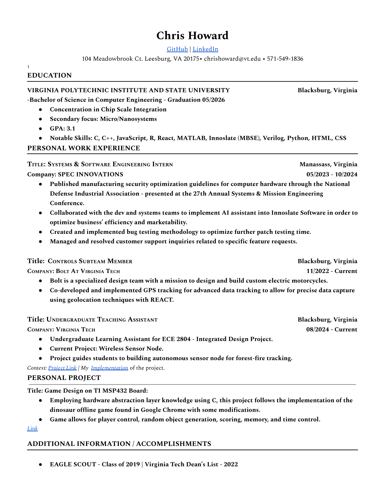

# the-chrishoward.github.io

Welcome to my personal website! I'm a **Computer Engineering Junior** at **Virginia Tech**, passionate about designing innovative solutions, learning cutting-edge technologies, and building impactful projects.

## About Me
I have a keen interest in:
- Embedded systems
- Software development
- Computer architecture
- Semiconductor Processing

At Virginia Tech, I'm continually refining my engineering skills, collaborating with peers, and exploring opportunities to bridge the gap between hardware and software.

## My Interests
Some of my favorite topics include:
- **Microcontroller Programming**: I enjoy working with Arduino, AtMega328p, and Raspberry Pi.
- **Software Development**: Languages like C++ and Python are of choice. I also have experience in REACT and Java/JavaScript.
- **Innovative Technologies**: I'm intrigued by advancements in AI, IoT, and machine learning.
- **Semiconductor Processing**: I have a strong interest in Semiconductor Manufacturing, and am taking several courses on the topic.

## Projects
Here are a few projects I've worked on at university:
1. **[Dinosaur Surfers](https://github.com/the-chrishoward/DinosaurSurfurs_Project)**: Dinosaur Embedded Systems Game - More Details in my Dinosaur_Surfers repository.
2. **[Binary Search Tree using a Treap](https://github.com/the-chrishoward/BinarySearch_Treap)**: Implements a Binary Search Tree using a Treap - More information and code in the BinarySearch_Treap repository.
3. **[Custom Stack Implementation](https://github.com/the-chrishoward/Custom_Stack)**: Implements a Custom Stack for use in C++, mimics the stack library commonly used - More Information in the Custom_Stack repository.

Check out my [GitHub repositories](https://github.com/the-chrishoward) for more!

## My Resume
Below is a snapshot of my resume. You can also [download the PDF version](ChrisHowardResume_Oct2024.pdf).

## Get in Touch
Feel free to connect with me on LinkedIn and stay updated on my career events.

## Contact Me
You can reach me at:  
**Email**: [chrishoward@vt.edu](mailto:chrishoward@vt.edu)  
**Location**: Blacksburg, Virginia
